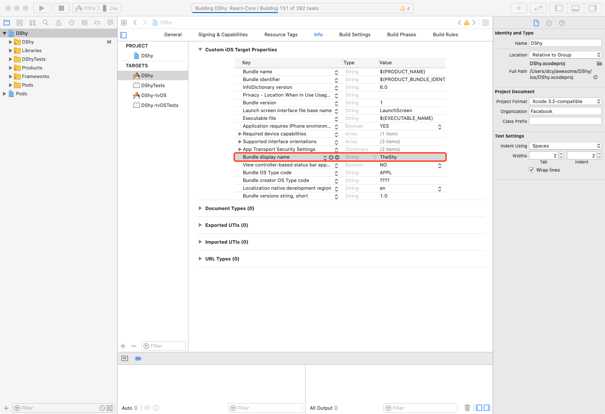
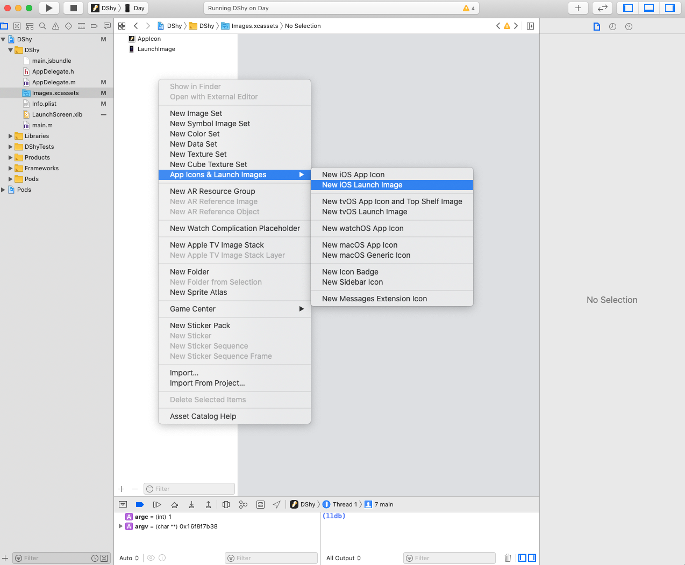
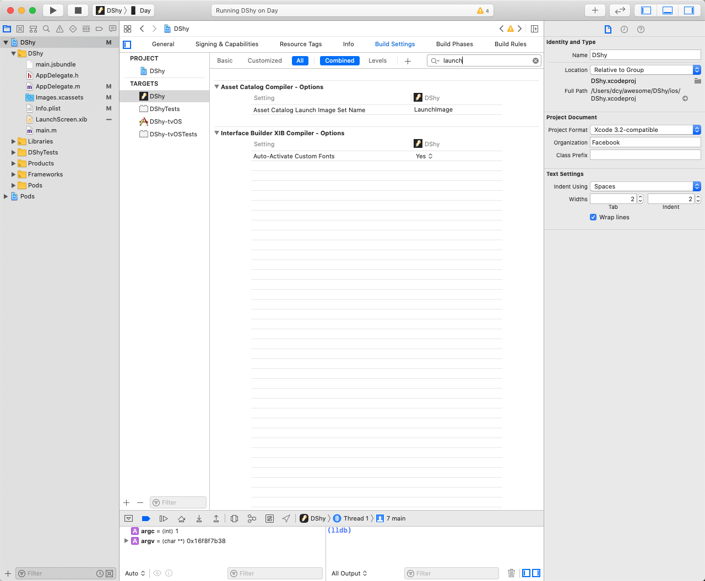

# React Native 设置名称、图标和启动页

## 设置 App 名称

### Android

1. **编辑 android/app/src/main/res/values/strings.xml 文件**

```xml
<resources>
    <string name="app_name">DShy</string>
</resources>
```

### iOS

1. <br />



## 图标

1. **图标尺寸 1024\*1024** [_图标工厂_](https://icon.wuruihong.com/icon?utm_source=ULC4S82T#/ios)

### Android

1. **替换 android/app/src/main/res 下对应图标**

| 文件夹名称     | 含义                      | 文件夹内部图片尺寸 | 文件夹内部图片名称 |
| :------------- | :------------------------ | :----------------- | :----------------- |
| mipmap-ldpi    | Low Density Screen        | 36x36              | ic_launcher.png    |
| mipmap-mdpi    | Medium Density Screen     | 48x48              | ic_launcher.png    |
| mipmap-hdpi    | High Density Screen       | 72x72              | ic_launcher.png    |
| mipmap-xhdpi   | Extra-high density screen | 96x96              | ic_launcher.png    |
| mipmap-xxhdpi  | xx-high density screen    | 144x144            | ic_launcher.png    |
| mipmap-xxxhdpi | xxx-high density screen   | 192x192            | ic_launcher.png    |

### iOS

1. <br />


| 尺寸      | 名称                                                | 用途                | 是否必须         |
| :-------- | :-------------------------------------------------- | :------------------ | :--------------- |
| 120x120   | [Icon-60@2x.png](mailto:Icon-60@2x.png)             | 桌面图标 (2x)       | 必须             |
| 180x180   | [Icon-60@3x.png](mailto:Icon-60@3x.png)             | 桌面图标 (3x)       | 可选，但推荐设置 |
| 80x80     | [Icon-40@2x.png](mailto:Icon-40@2x.png)             | Spotlight 图标 (2x) | 可选，但推荐设置 |
| 120x120   | [Icon-40@3x.png](mailto:Icon-40@3x.png)             | Spotlight 图标 (3x) | 可选，但推荐设置 |
| 58x58     | [Icon-29@2x.png](mailto:Icon-29@2x.png)             | 设置图标 (2x)       | 可选，但推荐设置 |
| 87x87     | [Icon-29@3x.png](mailto:Icon-29@3x.png)             | 设置图标 (3x)       | 可选，但推荐设置 |
| 40x40     | [Icon-20@2x.png](mailto:Icon-20@2x.png)             | 通知图标 (3x)       | 可选，但推荐设置 |
| 80x80     | [Icon-20@3x.png](mailto:Icon-20@3x.png)             | 通知图标 (3x)       | 可选，但推荐设置 |
| 1024x1024 | [iTunesArtwork@2x.png](mailto:iTunesArtwork@2x.png) | App Store (2x)      | 必须             |

## 启动页

[https://github.com/crazycodeboy/react-native-splash-screen/blob/master/README.zh.md](https://github.com/crazycodeboy/react-native-splash-screen/blob/master/README.zh.md)

```bash
$ yarn add react-native-splash-screen
$ react-native link react-native-splash-screen
```

### Android

1. **`<app>/android/app/src/main/java/com/dshy/MainActivity.java` **

```java
package com.dshy;

import android.os.Bundle; /** splash-screen */
import com.facebook.react.ReactActivity;
import org.devio.rn.splashscreen.SplashScreen; /** splash-screen */
public class MainActivity extends ReactActivity {

  @Override
    protected void onCreate(Bundle savedInstanceState) {
        SplashScreen.show(this);  /** splash-screen */
        super.onCreate(savedInstanceState);
    }

  /**
   * Returns the name of the main component registered from JavaScript. This is used to schedule
   * rendering of the component.
   */
  @Override
  protected String getMainComponentName() {
    return "TheShy";
  }
}

```

**`<app>/android/app/src/main/res/layout/launch_screen.xml`**

```xml
<?xml version="1.0" encoding="utf-8"?>
<RelativeLayout xmlns:android="http://schemas.android.com/apk/res/android"
                android:orientation="vertical" android:layout_width="match_parent"
                android:layout_height="match_parent">
    <ImageView android:layout_width="match_parent" android:layout_height="match_parent" android:src="@mipmap/screen" android:scaleType="centerCrop" />
</RelativeLayout>
```

3. **安卓设置背景透明**

`<app>/android/app/src/main/res/values/styles.xml`

```xml
<resources>
    <!-- Base application theme. -->
    <style name="AppTheme" parent="Theme.AppCompat.Light.NoActionBar">
        <!-- Customize your theme here. -->
        <item name="android:textColor">#000000</item>
        <!-- splash-screen -->
        <item name="android:windowIsTranslucent">true</item>
    </style>
</resources>
```

### iOS

1. **修改 `<app>/ios/<app>/AppDelegate.m`**

```
/**
 * Copyright (c) Facebook, Inc. and its affiliates.
 *
 * This source code is licensed under the MIT license found in the
 * LICENSE file in the root directory of this source tree.
 */

#import "AppDelegate.h"

#import <React/RCTBridge.h>
#import <React/RCTBundleURLProvider.h>
#import <React/RCTRootView.h>
#import "RNSplashScreen.h" /** splash-screen */

@implementation AppDelegate

- (BOOL)application:(UIApplication *)application didFinishLaunchingWithOptions:(NSDictionary *)launchOptions
{
  RCTBridge *bridge = [[RCTBridge alloc] initWithDelegate:self launchOptions:launchOptions];
  RCTRootView *rootView = [[RCTRootView alloc] initWithBridge:bridge
                                                   moduleName:@"DShy"
                                            initialProperties:nil];

  rootView.backgroundColor = [[UIColor alloc] initWithRed:1.0f green:1.0f blue:1.0f alpha:1];

  self.window = [[UIWindow alloc] initWithFrame:[UIScreen mainScreen].bounds];
  UIViewController *rootViewController = [UIViewController new];
  rootViewController.view = rootView;
  self.window.rootViewController = rootViewController;
  [self.window makeKeyAndVisible];
  [RNSplashScreen show];  // splash-screen

  return YES;
}

- (NSURL *)sourceURLForBridge:(RCTBridge *)bridge
{
#if DEBUG
  return [[RCTBundleURLProvider sharedSettings] jsBundleURLForBundleRoot:@"index" fallbackResource:nil];
#else
  return [[NSBundle mainBundle] URLForResource:@"main" withExtension:@"jsbundle"];
#endif
}

@end

```

> Xcode 11

1. **用 XCode 打开项目**
1. **选中  `LaunchScreen.xib`  中的 View，取消选中  `Use As Launch Screen`。**
1. **新建  LaunchImage, 上传对应尺寸图片  **
1. **应用配置 => General => App Icons and Launch Images => Launch Screen File 设置为空**
1. **应用配置 => Build Settings => Asset Catalog Launch Image Set Name 设置为 LaunchImage**<br />



```jsx
import React, {useEffect} from "react"
import {NavigationContainer} from "@react-navigation/native"
import SplashScreen from "react-native-splash-screen"
import {StackNavigator} from "./routes"
import {User} from "./stores"

export default function App() {
	useEffect(() => {
		SplashScreen.hide()
	}, [])

	return (
		<NavigationContainer>
			<User.Provider>
				<StackNavigator />
			</User.Provider>
		</NavigationContainer>
	)
}
```
